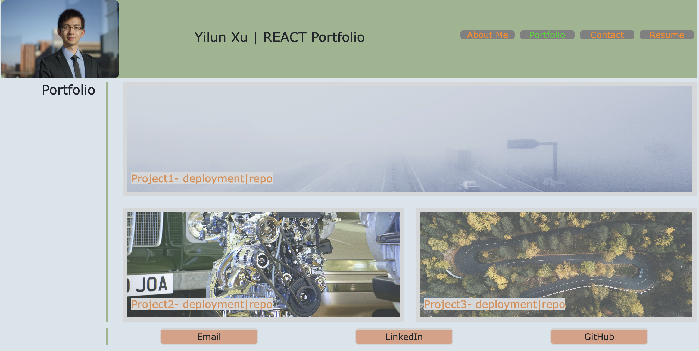

# REACT Portfolio

## Description
A single-page portfolio app to share with fellow developers my REACT projects.
Deployment: https://yxx-dev.github.io/React-Portfolio/

## Table of Contents
NA

## Installation
Node, Express, REACT

## Usage
For demonstration purpose only.  
Screenshot:  

## Credits
Developed from scratch

Markdown License badges:
https://gist.github.com/lukas-h/2a5d00690736b4c3a7ba

## License
MIT

## Badges

## Features
JavaScript, Node, Express, REACT

## How to Contribute
Coming soon...

## Tests
NA
